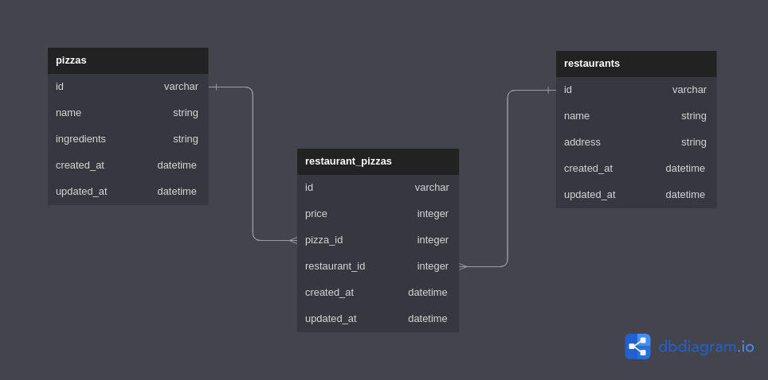

# phase-4-wk1-code-challenge-pizzas
This is a simple RESTful API that allows users to manage pizzas, restaurants and the pizzas they serve. It is built with Ruby on Rails.

We have three models: Restaurant, Pizza, and RestaurantPizza.

## Models

The following relationships have been established:

- A `Restaurant` has many `Pizzas` through `RestaurantPizza`

- A `Pizza` has many `Restaurants` through `RestaurantPizza`

- A `RestaurantPizza` belongs to a `Restaurant` and belongs to a `Pizza`

## Entity Relationship Diagram(ERD)

## Validations

The RestaurantPizza model has a validation that requires the price to be between 1 and 30.

**Routes**

The following routes have been set up:

- GET `/restaurants`: Returns a list of all restaurants in the database
- GET `/restaurants/:id`: Returns information about a specific restaurant, including the pizzas it serves
- DELETE `/restaurants/:id`: Deletes a specific restaurant and any associated `RestaurantPizza`s.
- GET `/pizzas`: Returns a list of all pizzas in the database
- POST `/restaurant_pizzas`: Creates a new `RestaurantPizza` and associates it with an existing `Pizza` and `Restaurant`

**Errors**

If a request is made with invalid parameters, the API will respond with a JSON error message.

If a request is made to incorrect resources, the API will respond with a JSON error message.

## Tools Used
This project was built with the following tools:

- Ruby on Rails

Documentation on the Ruby language can be found here: [Ruby Docs](https://docs.ruby-lang.org/en/3.1/)

## Pre-requisites
In order to use this repo you need to have the following installed:

- OS [either: Windows 10+, Linux or MacOS(running on x86 or arm architecture)]
- Ruby - 3.1.+

## Installation

To use this repo on your machine requires some simple steps

### Alternative One

- Open a terminal / command line interface on your computer
- Clone the repo by using the following:

        git@github.com:Sammy-CK/phase-4-wk1-code-challenge-pizzas.git

- Be patient as it creates a copy on your local machine for you.
- Change directory to the repo folder:

        cd phase-4-wk1-code-challenge-pizzas

- (Optional) Open it in ``Visual Studio Code``

        code .

- (Alternate Option) Open it in any editor of your choice.

### Alternative Two

- On the top right corner of this page there is a button labelled ``Fork``.
- Click on that button to fork the repo to your own account.
- Take on the process in ``Alternative One`` above.
- Remember to replace your username when cloning.

        git clone https://github.com/your-username-here/phase-4-wk1-code-challenge-pizzas

# Running the application

Running the application is very straight forward. You can use the following steps to run the app.

-   Install required gems
        
        bundle install

-   Migrate the tables onto the database

        rails db:migrate

-   Seed in the data from the Seed file

        rails db:seed

- Run the application on the terminal

      rails server

- The API can then be accessed using a tool like Postman.

# Authors
This project was contributed to by:
- [Sammy Cherono](https://github.com/Sammy-CK/)

# License
The project is licensed under Apache 2.0. 